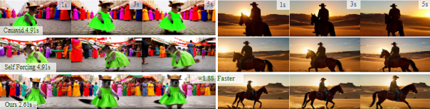
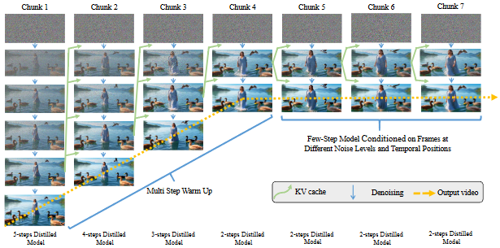
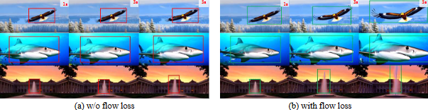

<p align="center" style="border-radius: 10px">
  
</p>

# 🎬 STREAMING AUTOREGRESSIVE VIDEO GENERATION VIA DIAGONAL DISTILLATION

[](https://arxiv.org/abs/2509.22622)
[](https://github.com/NVlabs/LongLive)
[](https://huggingface.co/Efficient-Large-Model/LongLive-1.3B)
[](https://www.youtube.com/watch?v=CO1QC7BNvig)
[](https://nvlabs.github.io/LongLive)

<!-- <div align="center">

[]

</div> -->

## 💡 TLDR: When you input, it only takes about 2.6 seconds to generate a 5-second segment!

**LongLive: Real-time Interactive Long Video Generation [[Paper](https://arxiv.org/abs/2509.22622)]** <br />
[Jinxiu Liu](https://andysonys.github.io/), [Xuanming Liu](https://aaron-weihuang.com/), [Kangfu Mei](https://ruihang-chu.github.io/), [Yandong Wen](https://easonxiao-888.github.io/), [Ming-Hsuan Yang](https://yuyangzhao.com/), [Weiyang Liu](https://peppaking8.github.io/) <br />

Large pretrained diffusion models have significantly enhanced the quality of gen- erated videos, and yet their use in real-time streaming remains limited. Autore- gressive models offer a natural framework for sequential frame synthesis but re- quire heavy computation to achieve high fidelity. Diffusion distillation can com- press these models into efficient few-step variants, but existing video distillation approaches largely adapt image-specific methods that neglect temporal dependen- cies. These techniques often excel in image generation but underperform in video synthesis, exhibiting reduced motion coherence, error accumulation over long se- quences, and a latency–quality trade-off. We identify two factors that result in these limitations: insufficient utilization of temporal context during step reduction and implicit prediction of subsequent noise levels in next-chunk prediction (ex- posure bias). To address these issues, we propose Diagonal Distillation, which operates orthogonally to existing approaches and better exploits temporal infor- mation across both video chunks and denoising steps. Central to our approach is an asymmetric generation strategy: more steps early, fewer steps later. This design allows later chunks to inherit rich appearance information from thoroughly pro- cessed early chunks, while using partially denoised chunks as conditional inputs for subsequent synthesis. By aligning the implicit prediction of subsequent noise levels during chunk generation with the actual inference conditions, our approach mitigates error propagation and reduces oversaturation in long-range sequences. We further incorporate implicit optical flow modeling to preserve motion qual- ity under strict step constraints. Our method generates a 5-second video in 2.61 seconds (up to 31 FPS), achieving a 277.3× speedup over the undistilled model.

## TABLE OF CONTENTS
1. [News](#news)
2. [Highlights](#highlights)
3. [Introduction](#introduction)
4. [Installation](#installation)
5. [Inference](#inference)
6. [Training](#training)
7. [How to contribute](#how-to-contribute)
8. [Citation](#citation)
9. [License](#license)
10. [Acknowledgement](#acknowledgement)

## News
- [x] [2025.9.25] We release [Paper](https://arxiv.org/abs/2509.22622), this GitHub repo [diagonal-distillation]( https://diagonal-distillation.github.io/) with all training and inference code, the model weight [LongLive-1.3B](https://huggingface.co/Efficient-Large-Model/LongLive-1.3B).

## Highlights
1. **Ultra-Fast Short Video Generation**: The proposed Diagonal Distillation framework achieves ​real-time 31 FPS generation​ for 5-second videos on a single H100 GPU, delivering a ​277.3× speedup​ over the base model while maintaining competitive visual quality.  This represents a 1.53× latency improvement over previous state-of-the-art methods, making it suitable for real-time streaming applications.
2. **Asymmetric Denoising Strategy**: Introducing a novel diagonal denoising approach that allocates more steps to early chunks (5 steps) and progressively fewer to later ones (down to 2 steps), rather than uniform step distribution.  This design allows later chunks to inherit rich appearance information from thoroughly processed early chunks, significantly reducing the total number of denoising steps while preserving coherence and detail in short video sequences.
3. **Motion-Preserving Distillation**: Incorporating Flow Distribution Matching that explicitly aligns temporal dynamics between teacher and student models, preventing motion degradation and amplitude attenuation under strict step constraints.  This ensures the distilled model not only matches the teacher in per-frame quality but also faithfully preserves motion characteristics crucial for short video synthesis.

## Introduction
<p align="center" style="border-radius: 10px">
  
<strong>Our Diagonal Distillation framework achieves comparable quality to the full-step model while significantly reducing latency. The method yields a 1.88× speedup on 5-second short video generation on a single H100 GPU.</strong>
</p>
<p align="center" style="border-radius: 10px">
  
<strong>Diagonal Denoising with Diagonal Forcing and Progressive Step Reduction. We illustrate our method starting with 5 denoising steps for the first chunk and progressively reducing them to 2 steps by Chunk 7 . For chunks with k ≥ 4, we use a fixed two-step denoising process, reusing the Key-Value (KV) cache from the previous chunk’s last noisy frame. This approach maintains temporal coherence while reducing latency, the pseudo-code is provided in the appendix.</strong>
</p>
<p align="center" style="border-radius: 10px">
  
<strong>(a) Without motion loss shows minimal motion amplitude with only slight object movement; (b) With motion loss demonstrates significantly increased motion amplitude throughout the entire frame, validating our method’s effectiveness.</strong>
</p>


## Installation
**Requirements**

We tested this repo on the following setup:
* Nvidia GPU with at least 40 GB memory (A100, and H100 are tested).
* Linux operating system.
* 64 GB RAM.

Other hardware setup could also work but hasn't been tested.

**Environment**

Create a conda environment and install dependencies:
```
git clone https://github.com/xuanmingliu/diagonal_distillation.git
cd diagonal_distillation
conda create -n diagonal_distillation python=3.10 -y
conda activate diagonal_distillation
pip install -r requirements.txt
pip install flash-attn --no-build-isolation
python setup.py develop
```

## Inference
**Download checkpoints**

```
huggingface-cli download Wan-AI/Wan2.1-T2V-1.3B --local-dir wan_models/Wan2.1-T2V-1.3B
huggingface-cli download Efficient-Large-Model/LongLive --local-dir longlive_models
```

**Short Video Generation**
```
bash inference.sh
```

**GUI demo**
```
python demo.py
```

## Training
**Download checkpoints**

Please follow [Self-Forcing](https://github.com/guandeh17/Self-Forcing) to download text prompts and ODE initialized checkpoint.

Download Wan2.1-T2V-14B as the teacher model.

```
huggingface-cli download Wan-AI/Wan2.1-T2V-14B --local-dir wan_models/Wan2.1-T2V-14B
```
**training**
```
bash training.sh
```


## How to contribute
- Make sure to have git installed.
- Create your own [fork](https://github.com/NVlabs/LongLive/fork) of the project.
- Clone the repository on your local machine, using git clone and pasting the url of this project.
- Read both the `Requirements` and `Installation and Quick Guide` sections below.
- Commit and push your changes.
- Make a pull request when finished modifying the project.


## Citation
Please consider to cite our paper and this framework, if they are helpful in your research.
```bibtex

```

## License


## Acknowledgement
- [Self-Forcing](https://github.com/guandeh17/Self-Forcing): the codebase and algorithm we built upon. Thanks for their wonderful work.
- [Wan](https://github.com/Wan-Video/Wan2.1): the base model we built upon. Thanks for their wonderful work.
